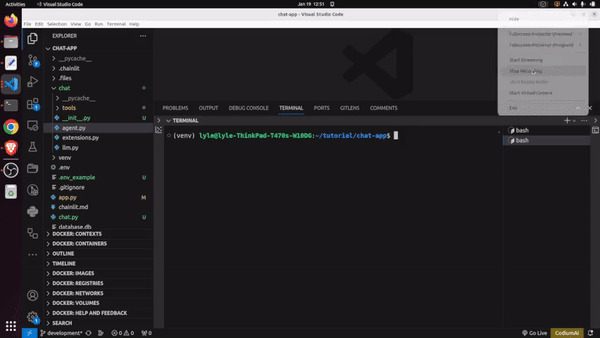

# chat-app

  

## Overview
This is a simple chat-app that answers users questions using four data sources:
- A backend database; this is an sql database that contains a single table that describes youtube videos i.e ``title, description, number of views, likes and comments``. An example query is ``Find me all the videos that have more than 1000 likes.``
- An API, in this case the youtube API. You can use it to search for playlists. An example query is ``Find me ten playlists that teach beginners how to develop applications with python and falsk.``
- Google Search; for the most recent information. An example query is ``Find me the latest news news on safaricom.``
- Chat-GPT; for information older tha two years.

## Getting started
To get started, you need:
- Python installed in your system
- An openai account with chat-gpt API keys
- A Google account
- YouTube credentials
- Google Search credentails

For creating Google Search credentials, follow the instructions in this [Stackoverflow thread](https://stackoverflow.com/questions/37083058/programmatically-searching-google-in-python-using-custom-search)

For creating youtube api credentials, follow the instructions in this [medium article](https://medium.com/@lyle-okoth/how-to-get-a-google-api-key-d3c38649eaae)

1. Clone the project repo
``sh
git clone https://github.com/twyle/chat-app.git
``
2. Navigate into the cloned folder
``sh
cd chat-app
``
3. Create and activate a python3 virtual environment
``python
python3 -m venv venv
source venv/bin/activate
``
4. Install project dependencies
``sh
pip install -r requirements.txt
``
5. Create the project secrets. These include the openai API key, the Google search credentails which include a ``GOOGLE_API_KEY and GOOGLE_CSE_ID`` and the youtube credentials(the path to the ``credentials.json`` file.). Check the ``.env_example`` file.
``sh
touch .env
``
6. Then fill it out as shown, replacing the values.env:
``sh
OPENAI_API_KEY=sk-xxxxxxxxx
OPENAI_MODEL=gpt-3.5-turbo-0613
CLIENT_SECRET_FILE=/home/lyle/Downloads/search.json
SQLALCHEMY_DATABASE_URI=sqlite:////home/lyle/tutorial/chat-app/database.db
GOOGLE_API_KEY=AIxxxxxxxx
GOOGLE_CSE_ID=axxxxxxxx
``
7. Generate the database data:
``python
python seed_database.py
``
8. Then run the application:
``python
python app.py
``